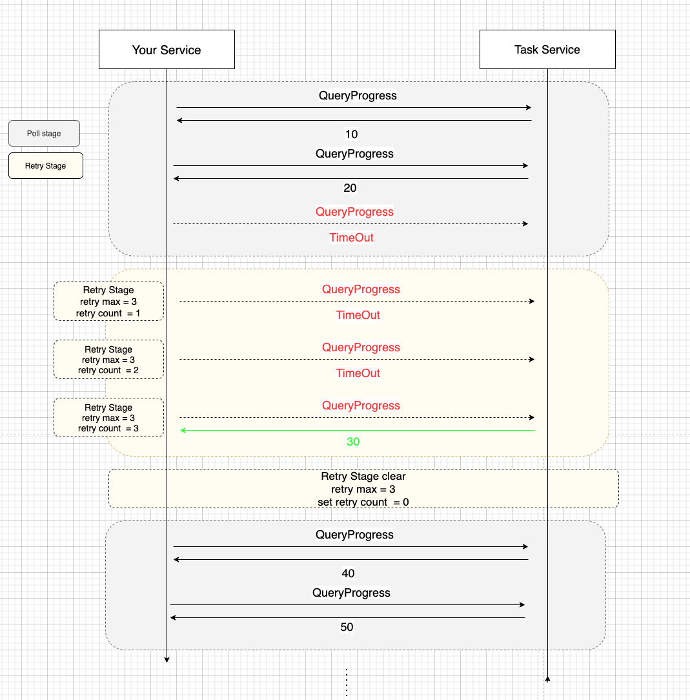

[**English docs**](./README_WIKI_EN.md)

## 简介

Attempt是一个轻量级组件，为应用程序提供声明式重试支持，不仅如此，它还提供了轮询策略。使用Attempt，您可以轻松地轮询具有重试功能的内容。非spring和轻量级应用程序对于较少的依赖关系是友好的。

## 教程
本节将快速介绍如何使用Attempt， 我们将从一个方法调用和一个静态调用的例子开始。

###  方法调用

+ 首先，定义基础类
```java
public class User {
    private int id;
    private String name;
    private Integer age;
    // 省略 get set 方法
}

public class UserService {
    public User queryUser (int id) {
        return new User(id, "test" + id, 1);
    }
}
```


+ 第二，构建Attempt代理对象

```java
UserService userService = new UserService();
// 使用 retry 方法来构建代理对象
AttemptBuilder.Retry<UserService> userRetry = new AttemptBuilder.Retry<UserService>(userService);
// 生成代理类
UserService userServiceAttempt = userRetry.build();
// 调用目标方法，并获取结果
User user = userServiceAttempt.queryUser(1);
```
由于我们queryUser 中并没没有出错，因此这段代码立刻返回，和直接调用并没有区别。

+ 异常重试

我们将 UserService 中的 queryUser 抛出一个RuntimeException 异常，并再次调用。

```java
public class UserService {
    public int count = 0;
    public User queryUser (int id) {
        count ++;
        throw new RuntimeException("queryUser error");
    }

    public static void main(String[] args) {
        UserService userService = new UserService();
        AttemptBuilder.Retry<UserService> userRetry = new AttemptBuilder.Retry<UserService>(userService);
        UserService userServiceAttempt = userRetry.build();
        try {
            User user = userServiceAttempt.queryUser(1);
        } catch (RuntimeException e) {
            System.out.println(e.getMessage());     // queryUser 发生异常
            // 注意这里拿到是 userService原始对象
            System.out.println(userService.count);      //原始方法已经调用3
        }
    }
}
```
可以看到， 当我们执行 userServiceAttempt 意图代理类的时候，遇到异常会自动重试三次。 如果三次还是失败，则将异常抛出。 因此count为3。
AttemptBuilder 可以使得对象中的成员方法有重试的行为，那么我们如何对静态方法赋予重试的功能呢？ 或者说，我重试某一类方法或者一个静态类如何做呢？

## 静态方法调用

```java
public class UserService {
    public int count = 0;
    public static int staticCount = 0;
    public User queryUser (int id) {
        count ++;
        throw new RuntimeException("queryUser error");
    }

    public static User queryUserStatic (int id) {
        staticCount ++;
        throw new RuntimeException("queryUser error");
    }

    public static void main(String[] args) {
        UserService userService = new UserService();
        try {
            AttemptBuilder.retry(() -> UserService.queryUserStatic(1)).exec();  //  count = 3
        } catch (RuntimeException e) {
           // ... staticCount > 3 之后，抛出异常
        }
    }
}

```

### 轮询策略

假设有这么一个场景，你上传了一个任务，服务方并不支持异步回调或者消息队列的方式通知你任务否执行完毕，那么你需要一个轮询策略，用于知道该任务的情况。
为了稳定性，你需要满足一下几个特点：
+ 如果查询进度的过程中失败了，那么需要为了让任务进行下去，必须要进行一个重试，比如说遇到了超时。
+ 如果超时3（重试最大次数暂定为3次）次，那么直接报错，返回失败。
+ 如果超时没有超过3次（重试最大次数暂定为3次）在重试期间，网络恢复了，那么要要清除重试3次的历史，否则下次遇到超时的时候就会失败。



如上图所示，Attempt 设置了轮询策略，当使用轮询策略的时候，在轮询期间会如果轮询过程中，出现异常，则会进入重试阶段。
在重试阶段会累计重试次数，如果重试成功，则会继续进入轮询阶段，并且清空重试阶段的重试次数。

样例如下：

```java
public class TaskService {
    public List<Integer> history = new ArrayList<>();
    public Integer nowProgress = 0;             // process
    public Integer queryProgressStep = 0;      // queryProgress invoke time
    //  Progress step need to throw exception
    public List<Integer> errorThrowOrder = new ArrayList<>();

    public Integer queryProgress () {
        history.add(nowProgress);
        queryProgressStep++;
        if(errorThrowOrder.contains(queryProgressStep)) {
            throw new RuntimeException("timeout exception:" + nowProgress);
        }
        SecurityThreadWaitSleeper.sleep(500);
        nowProgress +=10;

        return nowProgress;
    }

    public static void main(String[] args) {
        Integer retryCount = 3;
        TaskService taskService = new TaskService();
        // 2 3 3 count will throw RuntimeException
        taskService.errorThrowOrder = Stream.of(2, 3, 4).collect(Collectors.toList());
        // poll builder
        AttemptBuilder.Polling<TaskService> taskServicePollBuilder = new AttemptBuilder.Polling<>(taskService);
        // set end point
        TaskService taskServicePoll = taskServicePollBuilder.endPoint(context -> {
            // get last result
            AttemptResult result = context.getLastResult();
            if (result.isSuccess()) {
                Integer progress = result.getRetValue(Integer.class);
                return progress == 100;      //  progress < 100 poll continue
            }
            return false;
        })
         .maxPollCount(100)      // max poll times
         .registerExceptionRetryTime(RuntimeException.class, retryCount)   // the exception that should entry retry stage
         .build();

        try {
            Integer integer = taskServicePoll.queryProgress();
        }catch (RuntimeException e) {
            System.out.println("queryProgressStep:" + taskService.queryProgressStep); //
            System.out.println("history:" + taskService.history);//
        }
    }

}

```

+ 可以看到，当我们设定（2, 3, 4）次调用将会抛出异常， 遇到异常 RuntimeException.class, 重试3次的会后得到结果。
    ```
    queryProgressStep:4
    history:[0, 10, 10, 10]
    ```
调用了4次，进度在10中。也就是说 当调用次数为2，3，4 连续三次调用的时候，抛出异常。

+ 当我们设定 遇到异常 RuntimeException.class, 重试4次。但是我们说很设定了2，3，4 连续三次调用的时候才会抛出异常，因此调用成功返回100
    ```java
    // ......
    Integer retryCount = 4;
    // ......
    ```
+ 当我们设定异常序列为2，3，5，6，7的时候，由于23不连续，因此在23阶段重试后会继续调用，直到遇到567三次连续异常，才会结束。
    ```java
      Integer retryCount = 3;
      taskService.errorThrowOrder = Stream.of(2, 3, 5,6,7).collect(Collectors.toList());
    ```
    返回结果
    ```
    queryProgressStep:7
    queryProgressStep:[0, 10, 10, 10, 20, 20, 20]
    ```

## 性能
JMH对比了 SpringRetry 和 Attempt的性能，代码参见[这里](../src/test/java/io/github/icefrozen/jmh/AttemptVsSpringRetry.java)

Benchmark         |                                  Mode  |Cnt      |Score      |Error  |Units
---|---|---|---|---|---
IceFrozen.jmh.AttemptVsSpringRetry.testAttempt   |   avgt  | 10  |  210.878 ±  | 47.971 | ns/op
IceFrozen.jmh.AttemptVsSpringRetry.testSpringRetry|  avgt  | 10 | 17541.783 ± |1162.467 | ns/op


## 高级

TODO 


