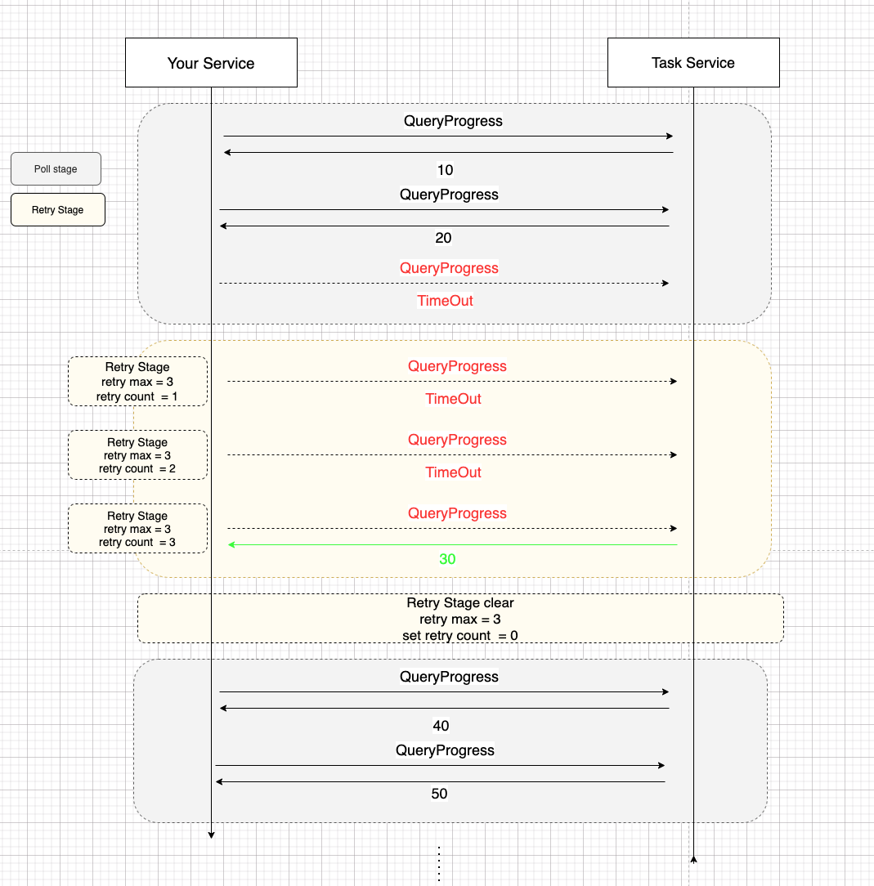

[**中文文档**](./README_WIKI_CN.md)

## Introduction

**Attempt** is a lightweight component provides declarative retry support for applications,  not only but a polling strategy.  With Attempt, you can easily poll for something with retry functionality. Non-spring and lightweight applications are friendly for a fewer dependencies.

## Quick Start
This section provides a quick introduction to getting started with Attempt. It includes a static method call example, and an object call example.

###  An Object Call example

+ First, define the base class
```java
public class User {
    private int id;
    private String name;
    private Integer age;
    // the set get method and constructor are ignored
}

public class UserService {
    public User queryUser (int id) {
        return new User(id, "test" + id, 1);
    }
}
```


+ Second, build Attempt

```java
UserService userService = new UserService();
// Building a Retry Policy
AttemptBuilder.Retry<UserService> userRetry = new AttemptBuilder.Retry<UserService>(userService);
// Generate the retry proxy Object
UserService userServiceAttempt = userRetry.build();
// invoke the method and get the result
User user = userServiceAttempt.queryUser(1);
```
Since there are no exceptions in queryUser, this code returns immediately, no different from a direct call.

+ Retry if an exception occurs.

Now we throw an RuntimeException in the queryUser method and call it again.
```java
public class UserService {
    public int count = 0;
    public User queryUser (int id) {
        count ++;
        throw new RuntimeException("queryUser error");
    }

    public static void main(String[] args) {
        UserService userService = new UserService();
        AttemptBuilder.Retry<UserService> userRetry = new AttemptBuilder.Retry<UserService>(userService);
        UserService userServiceAttempt = userRetry.build();
        try {
            User user = userServiceAttempt.queryUser(1);
        } catch (RuntimeException e) {
            System.out.println(e.getMessage());     // queryUser error
            // original object here
            System.out.println(userService.count);      // The original method has been called three times
        }
    }
}
```
As we see, when we execute the userServiceAttempt's queryUser method, the userServiceAttempt will be automatically retried three times. After that, the exception has been thrown. 
AttemptBuilder can make the method in a proxy object to retries when the exception has been thrown automatically? How do we assign retry to static methods?

## a static method call example

```java
public class UserService {
    public int count = 0;
    public static int staticCount = 0;
    public User queryUser (int id) {
        count ++;
        throw new RuntimeException("queryUser error");
    }

    public static User queryUserStatic (int id) {
        staticCount ++;
        throw new RuntimeException("queryUser error");
    }

    public static void main(String[] args) {
        UserService userService = new UserService();
        try {
            AttemptBuilder.retry(() -> UserService.queryUserStatic(1)).exec(); 
        } catch (RuntimeException e) {
           // ... staticCount > 3 then throw exception
        }
    }
}

```


### Polling Strategy

Suppose there is such a case, you upload a task, the server does not support callback or message queue to notify you whether the task is finish, then you need a polling strategy to know the status of the task.
For stability, you need to meet the following characteristics:：
+ if the process of querying the progress fails, then in order for the task to continue, it must be retried, for example, a call timeout occurs.
+ if the call fails after retries 3 times (the maximum number of retries is tentatively set to 3 times), then report an error directly and return failure.
+ if the network resumes trial operation at this stage, then clear the history three times and continue to poll the call.



As shown in the figure above, Attempt sets the polling strategy. If an exception occurs during the polling process, it will enter retry stage.
In retry stage, the number of retries will be accumulated. If retry is successful, it will continue to enter the polling phase, and the number of retries in retry phase will be cleared.

example：

```java
public class TaskService {
    public List<Integer> history = new ArrayList<>();
    public Integer nowProgress = 0;             // process
    public Integer queryProgressStep = 0;      // queryProgress invoke time
    //  Progress step need to throw exception
    public List<Integer> errorThrowOrder = new ArrayList<>();

    public Integer queryProgress () {
        history.add(nowProgress);
        queryProgressStep++;
        if(errorThrowOrder.contains(queryProgressStep)) {
            throw new RuntimeException("timeout exception:" + nowProgress);
        }
        SecurityThreadWaitSleeper.sleep(500);
        nowProgress +=10;

        return nowProgress;
    }

    public static void main(String[] args) {
        Integer retryCount = 3;
        TaskService taskService = new TaskService();
        // 2 3 3 count will throw RuntimeException
        taskService.errorThrowOrder = Stream.of(2, 3, 4).collect(Collectors.toList());
        // poll builder
        AttemptBuilder.Polling<TaskService> taskServicePollBuilder = new AttemptBuilder.Polling<>(taskService);
        // set end point
        TaskService taskServicePoll = taskServicePollBuilder.endPoint(context -> {
            // get last result
            AttemptResult result = context.getLastResult();
            if (result.isSuccess()) {
                Integer progress = result.getRetValue(Integer.class);
                return progress == 100;      //  progress < 100 poll continue
            }
            return false;
        })
         .maxPollCount(100)      // max poll times
         .registerExceptionRetryTime(RuntimeException.class, retryCount)   // the exception that should entry retry stage
         .build();

        try {
            Integer integer = taskServicePoll.queryProgress();
        }catch (RuntimeException e) {
            System.out.println("queryProgressStep:" + taskService.queryProgressStep); //
            System.out.println("history:" + taskService.history);//
        }
    }

}

```

+ It can be seen that when we set (2, 3, 4) calls, an exception will be thrown, and the result will be obtained after encountering the exception RuntimeException.class, and retrying 3 times.
    ```
    queryProgressStep:4
    history:[0, 10, 10, 10]
    ```

Called 4 times, progress is in 10. That is to say, when the number of calls is 2, 3, and 4 three consecutive calls, an exception has been thrown.

+ When we set an exception RuntimeException.class, retry 4 times. But we said that the exception will be thrown when 2, 3, and 4 are called three times in a row, so the call returns 100 successfully.
    ```java
    // ......
    Integer retryCount = 4;
    // ......
    ```
+ When we set the exception sequence to 2, 3, 5, 6, 7, since 23 is not continuous, it will continue to be called after retrying in stage 23, and it will not end until it encounters 567 three consecutive exceptions.
    ```java
      Integer retryCount = 3;
      taskService.errorThrowOrder = Stream.of(2, 3, 5,6,7).collect(Collectors.toList());
    ```
    返回结果
    ```
    queryProgressStep:7
    queryProgressStep:[0, 10, 10, 10, 20, 20, 20]
    ```


## Performance VS SpringRetry
code [here](../src/test/java/io/github/icefrozen/jmh/AttemptVsSpringRetry.java)

Benchmark         |                                  Mode  |Cnt      |Score      |Error  |Units
---|---|---|---|---|---
IceFrozen.jmh.AttemptVsSpringRetry.testAttempt   |   avgt  | 10  |  210.878 ±  | 47.971 | ns/op
IceFrozen.jmh.AttemptVsSpringRetry.testSpringRetry|  avgt  | 10 | 17541.783 ± |1162.467 | ns/op


## Advanced

TODO
